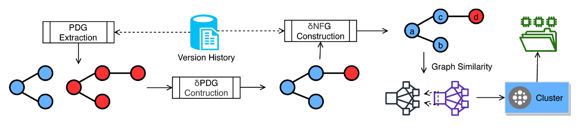

# FLEXEME

Today, most developers bundle changes into commits that they submit to a shared code repository. 
Tangled commits intermix distinct concerns, such as a bug fix and a new feature. 
They cause issues for developers, reviewers, and researchers alike: they restrict the usability of tools such as git bisect, make patch comprehension more difficult, and force researchers who mine software repositories to contend with noise. 
We present a novel data structure, the 𝛿-NFG, a multiversion Program Dependency Graph augmented with name flows. 
A 𝛿-NFG directly and simultaneously encodes different program versions, thereby capturing commits, and annotates data flow edges with the names/lexemes that flow across them. 
Our technique, Flexeme, builds a 𝛿-NFG from commits, then applies Agglomerative Clustering using Graph Similarity to that 𝛿-NFG to untangle its commits. 
At the untangling task on a C# corpus, our implementation, Heddle, improves the state-of-the-art on accuracy by 0.14, achieving 0.81, in a fraction of the time: Heddle is 32 times faster than the previous state-of-the-art.

This work was done under the supervision of [Earl T. Barr](https://earlbarr.com/) and 
in collaboration with [Santanu K. Dash](https://santanu.uk/), and [Miltos Allamanis](https://miltos.allamanis.com/).

A pre-recorded presentation of the work is available [here](https://liveuclac-my.sharepoint.com/:v:/g/personal/ucabpp1_ucl_ac_uk/EbZ-iehHCHBDjAvftTBWBYkBCiqIRg3nmvwxg6S12TViSQ?e=t9vPM6).
Slides can be downlaoded from [here](./Flexeme_FSE_profirpp.pdf).
